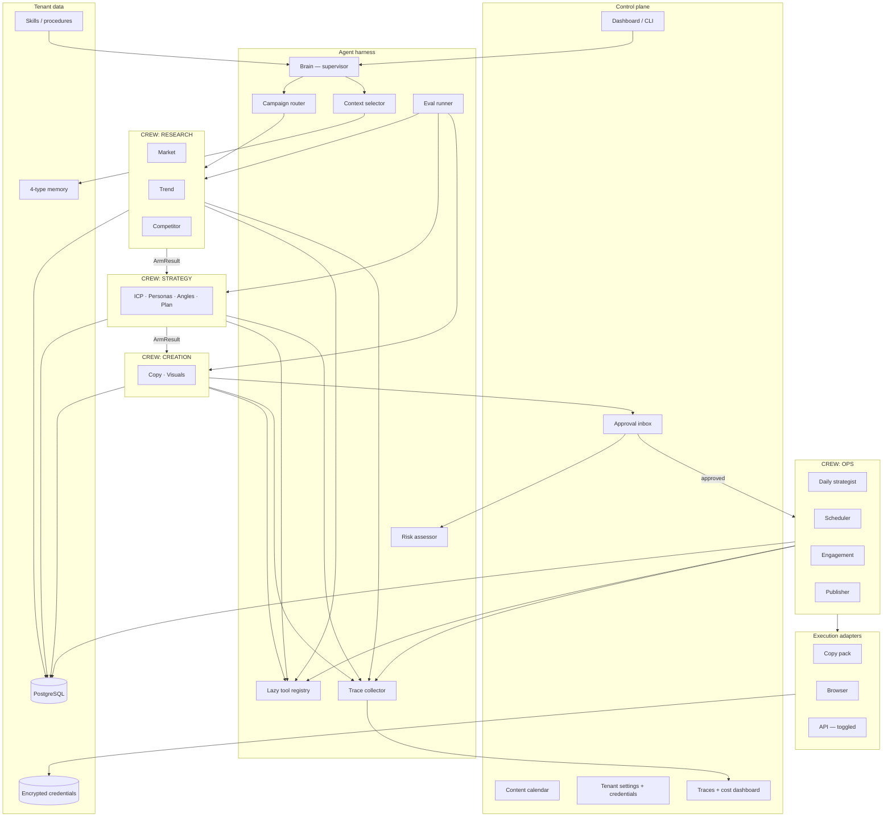

# Marketing Agent — Design Spec

**Status:** v3 — **Supervised Crew** (final architecture)  
**Date:** 2026-07-16  
**Codename:** Supervised Crew — One Brain, Specialist Team

**Informed by:** [Agent Harness anatomy](https://blog.dailydoseofds.com/p/the-anatomy-of-an-agent-harness), [Agentic AI Engineer roadmap](https://youmind.com/landing/x-viral-articles/agentic-ai-engineer-roadmap-guide), [Min(Input)→Max(Output)](https://ahmedhesham.dev/blog/min-input-max-output/), Veeza computer-use production lessons, repo `skills/` ship-loop.

**Architecture decision (locked):** Multi-agent **supervised crew** with structured handoffs — **not** a single mega-prompt, **not** chatty agents debating in one thread.

---

## 1. Problem & goal

Build a **multi-tenant marketing agent** that runs the full marketing cycle for any business workspace:

- Strategy: personas, positioning, marketing plan, messaging
- Intelligence: trend radar + competitor deep analysis
- Content: post recommendations with **approve / edit / reject**
- Operations: daily cross-platform strategy, scheduling, comment **and private message (DM)** reply drafts
- Execution: **human-gated** publish paths optimized for organic reach

**Success looks like:** A user creates a tenant (brand workspace), onboards their business once, and gets daily actionable marketing output — with every external action gated behind explicit approval and a chosen publish mode.

**Design principle:** The LLM is the CPU. The **harness is the product**. Two deployments using the same model can differ wildly based on orchestration, context selection, verification, and guardrails alone.

---

## 1.1 Marketing cycle — four pillars

The product follows one end-to-end marketing cycle. Every arm and phase maps to a pillar. The Brain orchestrates the cycle; **ship-loop** gates each pillar before the next tranche of work ships.

```
THE MARKETING AGENT
├───────────────┬─────────────────┬──────────────┬────────────┐
│ 1. RESEARCH   │ 2. STRATEGY     │ 3. CREATION  │ 4. OPS     │
│ Market / SERP │ ICP / Personas  │ Copywriting  │ Email      │
│ Competitors   │ Angles / Hooks  │ Visuals      │ Social     │
└───────────────┴─────────────────┴──────────────┴────────────┘
```

### Pillar → capability map

| Pillar | Capabilities | Arms / modules | Primary outputs |
|--------|--------------|----------------|-----------------|
| **1. RESEARCH** | Market & SERP intelligence | **Market** arm (SERP, keywords, demand signals) + **Trend** arm | `intel_snapshots` type=market, type=trend |
| | Competitor intelligence | **Competitor** arm | `intel_snapshots` type=competitor |
| | Competitor campaign watch | **Competitor watch** (scheduled) | `competitor_alerts` when a rival launches a campaign |
| | Counter-campaign assist | Brain → STRATEGY + CREATION | Response campaign drafts from alert |
| **2. STRATEGY** | ICP & personas | **Strategy** arm | `icp_profiles`, `personas` |
| | Angles & hooks | **Strategy** arm (messaging layer) | `messaging_angles` |
| | Channel plan | **Strategy** arm | `marketing_plans` |
| **3. CREATION** | Copywriting | **Content** arm (Jordan) | `content_drafts` channel=social \| email |
| | Visual briefs | **Content** arm | `visual_briefs` (prompt + size + mood) linked to drafts |
| | Image generation | **Image adapter** (Nano Banana / Gemini) — optional | `generated_assets` attached to drafts |
| **4. OPS** | Email operations | **Scheduler** + **Publisher** (email adapters) | schedules, copy packs, optional send |
| | Social operations | **Scheduler** + **Engagement** + **Publisher** | posts, **comment + DM replies**, calendar |
| | Daily coordination | **Daily strategist** | `daily_briefs` (email + social priorities) |

### Cycle execution order (per tenant)

```
ONBOARD → RESEARCH (market + trend + competitor, parallel)
       → STRATEGY (ICP → personas → angles/hooks → plan)
       → CREATION (copy + visual briefs [+ optional Nano Banana images] → approval inbox)
       → OPS (daily brief → schedule → engage → publish when approved)
```

Re-run **RESEARCH** on a schedule (24h staleness) or on demand. **CREATION** consumes latest RESEARCH + STRATEGY only — never stale angles or intel.

### Skills per pillar (repo `skills/`)

| Pillar | Skills applied |
|--------|----------------|
| RESEARCH | `grill-with-docs` (validate intel against tenant profile), ship-loop gate |
| STRATEGY | `grill-with-docs`, ship-loop gate |
| CREATION | `frontend-visual-qa` (draft + image previews), ship-loop gate |
| OPS | `frontend-visual-qa` (inbox + calendar), ship-loop gate, human approval gate |

---

## 1.2 Supervised Crew — final architecture

Marketing needs specialists. Industry best practice is a **small team of virtual experts** — but production systems use a **supervisor + typed handoffs**, not agents free-chatting in one context window.

### Why not a single agent?

One prompt doing research + ICP + copy + scheduling produces generic, shallow output. Context rots; tools collide; quality drops.

### Why not a chatty multi-agent crew?

Agents “talking to each other” in a shared thread causes coordination overhead, silent bad handoffs, token explosion (~15×), and review loops. **Rejected for v1.**

### What we build instead: Supervised Crew

```
                  ┌────────────────────────┐
                  │   Human campaign idea  │
                  └───────────┬────────────┘
                              ▼
                  ┌────────────────────────┐
                  │   BRAIN (Supervisor)   │
                  │   routes · never redo  │
                  │   specialist work      │
                  └───────────┬────────────┘
                              ▼
        ┌─────────────────────┼─────────────────────┐
        ▼                     ▼                     ▼
┌───────────────┐   ┌───────────────┐   ┌───────────────┐
│ CREW: RESEARCH│   │ CREW: STRATEGY│   │ (parallel     │
│ Market        │   │ ICP           │   │  research     │
│ Trend         │   │ Personas      │   │  only)        │
│ Competitor    │   │ Angles/Hooks  │   └───────────────┘
└───────┬───────┘   │ Plan          │
        │           └───────┬───────┘
        │    ArmResult      │ ArmResult
        └──────────┬────────┘
                   ▼
        ┌──────────────────────┐
        │ CREW: CREATION         │
        │ Copy (social + email)  │
        │ Visual briefs          │
        └───────────┬────────────┘
                    ▼
        ┌──────────────────────┐
        │ HUMAN APPROVAL GATE  │  ← non-negotiable
        └───────────┬──────────┘
                    ▼
        ┌──────────────────────┐
        │ CREW: OPS            │
        │ Daily · Schedule     │
        │ Engage · Publish     │
        └──────────────────────┘
```

### Specialist roster (UI-facing personas)

Same harness underneath; friendly names in the dashboard:

| Persona | Role | Arms | Pillar |
|---------|------|------|--------|
| **Alex** | Lead Market Researcher | Market, Trend, Competitor | RESEARCH |
| **Sam** | Persona & Strategy Lead | Strategy (ICP → personas → angles → plan) | STRATEGY |
| **Jordan** | Expert Copywriter + visual director | Content (copy + visual briefs) → optional Image adapter | CREATION |
| **Ops** | Campaign operator | Daily strategist, Scheduler, Engagement, Publisher | OPS |

The Brain is not a persona — it is the **supervisor runtime** (orchestrator + permissions + traces).

### Handoff contract (best practice)

Specialists never pass chat logs. They pass **`ArmResult`**:

- `summary` — max ~2k tokens for supervisor/next crew
- `data` — typed, persisted to DB (source of truth)
- `citations` — required for RESEARCH crew
- `confidence` — optional; low confidence → flag for human

**Rule:** CREATION crew reads `messaging_angles` + intel summaries from DB — never raw SERP HTML.

### Orchestration pattern per crew

| Crew | Pattern | Why |
|------|---------|-----|
| RESEARCH | **Parallel** plan-and-execute (3 arms at once) | Independent domains; faster |
| STRATEGY | **Sequential** plan-and-execute (ICP → personas → angles → plan) | Each step depends on prior |
| CREATION | **Single** ReAct loop (copy → visual brief → optional image gen) | Tight coupling within one deliverable |
| OPS | **Deterministic** workflow + human gates | Irreversible actions need control |

---

## 1.3 Locked best-practice decisions

These are final — do not revisit without strong evidence.

| Decision | Choice | Rationale |
|----------|--------|-----------|
| Agent topology | Supervised crew + thin Brain | Specialization without chatty multi-agent failure modes |
| Handoffs | Typed `ArmResult` to DB | Verifiable, resumable, eval-friendly |
| Loop style | Plan-and-execute between crews; ReAct inside an arm | 3.6× faster than pure ReAct chains (LLMCompiler); flexible within arm |
| Context | Min sufficient per arm; lazy tools | [Context engineering](https://blog.dailydoseofds.com/p/the-anatomy-of-an-agent-harness) — quality over volume |
| Model routing | Fast / balanced / deep per task | Cost + quality balance |
| Verification | Rules + eval suite + ship-loop; judge ≠ producer | Deterministic beats self-grading |
| Publish | Copy pack default; browser/API toggled | Organic reach; human arms execution |
| Image gen | Nano Banana optional; Jordan writes prompt | Pixels ≠ copy; toggle off by default |
| Permissions | Harness enforces; model only proposes | Anthropic separation pattern |
| Multi-tenancy | Day one | Product requirement |
| UI | 4-pillar + crew personas + **tenant feature toggles** | Matches mental model |

---

## 1.4 Control Plane UI (web dashboard)

**Yes — a full frontend is planned (Phase 9).** This is how you and your customers control the agent without touching code or env files.

### Who uses it

| User | What they control |
|------|-----------------|
| **You (platform admin)** | Deploy config, default feature flags, billing/limits |
| **Customer (tenant admin)** | Their brand workspace: enable/disable features, credentials, approvals |

Multi-tenant from day one: every toggle and credential is scoped to `tenant_id`.

### Pages (v1)

| Page | Purpose |
|------|---------|
| **Dashboard** | 4-pillar overview + crew activity (Alex / Sam / Jordan / Ops) |
| **Activity** | Full event stream (`system_events`) — filters by category / severity |
| **Research** | Intel snapshots + **competitor alerts** |
| **Campaign** | Start campaign / **counter-campaign from alert**; pipeline status |
| **Strategy** | ICP, personas, angles, plan (edit + re-run) |
| **Creation** | Draft queue — approve / edit / reject |
| **Calendar** | Email + social schedule |
| **Engagement** | Comment + **DM / inbox message** reply drafts |
| **Platform settings** | Per-platform feature toggles + credentials |
| **Traces** | Cost, latency, errors per run (`agent_traces`) |
| **Audit** | Compliance view (`audit_log`) |

### Feature toggles (per tenant, per platform)

Customers activate only what they need. Turning a feature **on** opens a credential wizard if required.

| Toggle | Default | When enabled |
|--------|---------|--------------|
| `competitor_watch_enabled` | On | Poll competitors for new campaign signals |
| `competitor_alert_notify` | On | Notify when a rival campaign is detected |
| `strategy_enabled` | On | Sam crew runs |
| `creation_enabled` | On | Jordan crew runs (copy + visual briefs) |
| `image_gen_enabled` | Off | Nano Banana / Gemini generates images from visual briefs |
| `daily_brief_enabled` | On | Ops daily brief cron |
| `scheduler_enabled` | On | Calendar + reminders |
| `engagement_enabled` | On | Comment + DM reply draft generation |
| `browser_publish_enabled` | Off | Armed Playwright publish |
| `api_publish_enabled` | Off | Social API publish + credential form |
| `api_reply_enabled` | Off | API replies on **public comments** |
| `api_dm_reply_enabled` | Off | API replies on **private messages / DMs** |
| `api_email_enabled` | Off | Email send via SMTP/SendGrid/Resend |

`publish_mode` preference: `copy_pack` | `browser` | `api` (default `copy_pack`).

**Rules:** Enabling publish/reply/email never bypasses the **approval inbox**. HIGH-risk actions always need human OK.

### Docker + UI

- **Dev:** `docker compose up` → web on **http://localhost:8080**, API on **http://localhost:3001**
- **Prod:** `docker compose -f docker-compose.yml -f docker-compose.prod.yml up -d` → web on port 80; DB/Redis internal only
- Nginx proxies `/api/*` to the API container

Placeholder UI ships now; full React dashboard in Phase 9.

---

## 2. Architecture options (decision record)

### Option A — Single monolith agent ❌ Rejected

One LLM loop with all tools. Fast to demo; fails on quality and context at scale.

### Option B — Supervised Crew + thin Brain ✅ **Selected**

Specialist **crews** (arms) with structured handoffs; Brain supervises routing only. Maps to production harness, four pillars, and industry multi-agent best practice without chatty coordination.

### Option C — Event-driven microservices ❌ Deferred

Scale later if needed; overkill for v1.

### Option D — Chatty multi-agent crew ❌ Rejected

CrewAI-style open collaboration. High token cost, handoff failures, demo-only reliability.

**Final stack:** Option B — Supervised Crew implemented as Brain + nine arms + harness (traces, evals, guardrails, memory).

---

## 3. Agent harness mapping

The harness is everything around the model: orchestration, tools, memory, context, state, errors, guardrails, verification, and observability. This table is the build checklist.

| Harness component | Marketing agent implementation |
|-------------------|------------------------------|
| **1. Orchestration loop** | Brain runs TAO (thought-action-observation) per arm; dumb loop, smart model |
| **2. Tools** | Lazy-loaded per arm; schema-validated; sandboxed execution |
| **3. Memory** | Four memory types per tenant (see §5) |
| **4. Context management** | Minimum sufficient context per step; arm-scoped prompts; compaction when buffer grows |
| **5. Prompt construction** | Priority stack: system → arm skill → tenant profile → working state → user trigger |
| **6. Output parsing** | Native tool calls + Zod-validated structured outputs; never trust raw strings |
| **7. State management** | DB persistence + checkpoints on schedules and browser publish flows |
| **8. Error handling** | Four error classes with defined recovery (see §14) |
| **9. Guardrails** | Risk assessor + approval inbox + tool permission layer separate from model |
| **10. Verification loops** | Eval suite + ship-loop gate; deterministic checks over self-grading |
| **11. Subagent orchestration** | Nine specialist arms in four crews; 1–2k token `ArmResult` handoffs |

**Harness thickness:** Keep the Brain thin. Arms own domain reasoning. Verification and permissions live in the harness, not in prompt hope.

---

## 4. System overview



---

## 5. Memory architecture

An agent with no memory repeats itself. Memory is not one table — it is four timescales, all scoped by `tenant_id`.

| Type | Scope | Storage | Used for |
|------|-------|---------|----------|
| **Short-term** | Current arm run | In-memory conversation buffer | Tool loop within one job |
| **Working** | Current job / daily cycle | `working_memory` JSON on job record | Today's brief context, partial intel |
| **Long-term** | Cross-session | `tenant_profiles`, `personas`, `marketing_plans`, preferences | Voice, goals, stable decisions |
| **Episodic** | Historical runs | `intel_snapshots`, `audit_log`, `agent_traces` | What happened before; week-over-week intel |

### Compaction rules

- When short-term buffer exceeds ~20 turns, summarize older turns with a **cheap model**, keep last 10 verbatim.
- Preserve: architectural decisions, unresolved constraints, approval decisions, brand voice rules.
- Discard: redundant raw tool outputs (observation masking).
- Never compact away: active approval state, scheduled item checkpoints, credential flags.

### Retrieval principle

Make maximum context **reachable**, deliver **minimum sufficient** context per arm call. Strategy arm does not load browser publish tools. Publisher arm does not load competitor research transcripts.

---

## 6. Model routing

Not every step needs the most expensive model. Route by task complexity to control cost and latency.

| Task class | Examples | Default tier | Rationale |
|------------|----------|--------------|-----------|
| **Fast** | Classify intent, extract fields, summarize intel, compact memory | `claude-haiku` / `gpt-4o-mini` | High volume, low reasoning depth |
| **Balanced** | Draft posts, reply drafts, daily brief, trend summaries | `claude-sonnet` / `gpt-4o` | Quality + speed balance |
| **Deep** | Strategy plan, competitor deep analysis, eval judge | `claude-opus` / best available | High-stakes reasoning |

Configuration via `MODEL_ROUTING` env or per-tenant override in settings. Every LLM call logs model ID, tokens, cost, and latency to `agent_traces`.

**Rule:** Track cost per tenant per day from day one. Alert when a tenant exceeds budget threshold.

---

## 7. Multi-tenancy model

**One shared PostgreSQL database for all customers.** Isolation is by `tenant_id` on every row — not a separate database per customer.

| Approach | Verdict |
|----------|---------|
| **One DB, `tenant_id` on every table** | ✅ **Selected** — simpler ops, one migration story, one Docker Postgres, cheaper |
| Database-per-customer | ❌ Deferred — only if a large enterprise requires hard isolation later |

### How isolation works

- Middleware injects `tenant_id` on every query; no cross-tenant reads
- Credentials, events, drafts, and engagement items are all tenant-scoped
- Demo tenant and real customers share the same schema and instance
- Optional later: Postgres Row-Level Security (RLS) as a second defense

Every record is scoped by `tenant_id`. No cross-tenant reads.

| Entity | Purpose |
|--------|---------|
| `tenants` | Brand workspace (name, industry, locale, timezone) |
| `tenant_profiles` | Onboarding: description, audience, goals, voice, competitors list, platforms |
| `icp_profiles` | Ideal Customer Profile: firmographics, pain points, buying triggers |
| `personas` | Generated + editable buyer personas (derived from ICP) |
| `messaging_angles` | Positioning angles, hooks, proof points per channel |
| `marketing_plans` | Versioned plans (channels, themes, KPIs, calendar skeleton) |
| `competitors` | Tracked accounts/pages per platform |
| `competitor_alerts` | Detected rival campaigns (new burst of posts/ads/hooks) + status |
| `campaigns` | Your campaigns (goal, status, linked drafts, optional `response_to_alert_id`) |
| `intel_snapshots` | Market, trend, and competitor runs (timestamped, cite sources) |
| `content_drafts` | Copy: channel `social` \| `email`, platform, body, rationale, status |
| `visual_briefs` | Visual direction per draft: format, mood, aspect ratio, Nano Banana prompt, brand refs |
| `generated_assets` | AI-generated images (path/URL, model, prompt used, variant index, draft_id) |
| `approval_queue` | Unified queue: posts, emails, images, schedules, comment replies, **DM replies** |
| `schedules` | Soft calendar entries + optional armed execution |
| `engagement_items` | Inbound social threads: `type=comment` \| `type=message` (DM) + draft replies |
| `daily_briefs` | Daily strategist output per tenant per day |
| `platform_connections` | Per-platform settings + publish mode + feature flags |
| `credentials` | Encrypted tokens/secrets per tenant per platform |
| `audit_log` | Compliance subset: approvals, credential changes, publish/send outcomes (append-only) |
| `system_events` | **Full activity stream** — every action and event (see §7.1) |
| `agent_traces` | Per-run LLM/tool observability (steps, tokens, cost, latency, errors) |
| `jobs` | Async arm/campaign job queue state |
| `eval_runs` | Eval suite results per arm / per deploy |

**Demo tenant:** Seed one workspace at install so demos work without setup. Real tenants use the same schema.

---

## 7.1 Database & event logging (system of record)

**PostgreSQL is the single source of truth.** Domain state, agent runs, and a complete action/event history all live there. Nothing important exists only in memory or console logs.

### Three logging layers (do not collapse into one)

| Layer | Table | Answers | Retention |
|-------|-------|---------|-----------|
| **1. Domain state** | `content_drafts`, `schedules`, `intel_snapshots`, etc. | What is the current marketing state? | Forever (product data) |
| **2. Runtime traces** | `agent_traces` | What did the LLM/tools do inside a job? (tokens, cost, steps) | 90 days default; export before purge |
| **3. Action / event stream** | `system_events` | What happened across the whole system? Who did what, when? | Forever (or 1 year + cold archive) |
| **4. Compliance audit** | `audit_log` | Sensitive subset of events for security/compliance review | Forever, append-only |

`system_events` is the **activity feed** in the UI. `audit_log` is a stricter, smaller set (approvals, credential writes, publish/send, toggle changes). Every `audit_log` row also appears in `system_events` (same `event_id`).

### What must be logged (non-negotiable)

Every significant action writes a `system_events` row:

| Category | Examples |
|----------|----------|
| **Tenant lifecycle** | Tenant created, onboarded, settings updated |
| **Feature toggles** | `api_publish_enabled` on/off, publish mode changed |
| **Credentials** | Credential saved / rotated / health-check failed (never store secret values in the event payload) |
| **Campaign / crew** | Campaign started, RESEARCH finished, STRATEGY finished, CREATION finished |
| **Arm jobs** | Job queued, running, completed, failed (link `job_id` + `trace_id`) |
| **Approvals** | Draft created, approved, edited, rejected |
| **Ops** | Scheduled, reminded, armed, published, publish failed, reply sent |
| **Guardrails** | Risk HIGH blocked, permission denied, sanitizer stripped content |
| **Budget** | Daily budget warning / hard stop |
| **Evals** | Eval suite started / passed / failed |

### `system_events` schema

```typescript
interface SystemEvent {
  id: string;                 // uuid
  tenant_id: string;
  created_at: string;         // ISO timestamp
  actor_type: 'user' | 'system' | 'crew' | 'adapter';
  actor_id?: string;          // user id, persona (alex|sam|jordan|ops), or adapter id
  category: string;           // tenant | toggle | credential | campaign | job | approval | ops | guardrail | budget | eval
  action: string;             // e.g. draft.approved, campaign.started, publish.failed
  resource_type?: string;     // content_draft | schedule | platform_connection | ...
  resource_id?: string;
  job_id?: string;
  trace_id?: string;
  campaign_id?: string;
  severity: 'info' | 'warning' | 'error' | 'critical';
  message: string;            // human-readable one-liner for activity feed
  payload: Record<string, unknown>; // structured metadata — NO secrets, NO full prompt dumps
  ip?: string;                // for user-initiated actions
}
```

### `audit_log` (compliance subset)

Append-only. Same shape as above for: approvals, credential changes, feature toggles affecting publish/reply/email, and every publish/send/reply attempt (success or fail). Immutable — no UPDATE/DELETE from application code.

### `agent_traces` (LLM / tool depth)

| Field | Purpose |
|-------|---------|
| `trace_id` | Correlates all steps in one arm/job |
| `tenant_id`, `arm`, `crew`, `job_id`, `campaign_id` | Scope |
| `steps[]` | action, tool, model, input_tokens, output_tokens, latency_ms, cost_usd, error |
| `status` | running \| completed \| failed |
| `total_cost_usd`, `total_latency_ms` | Aggregates |

**Rule:** Every LLM call appends a step. Every tool call appends a step. Failures are steps with `error`, not silent drops.

### Correlation IDs (how you debug one campaign)

```
campaign_id
  └── job_id (per arm)
        └── trace_id (LLM/tool steps)
              └── system_events (rows tagged with all three IDs)
```

From the UI: open a campaign → see events timeline → click a job → see full trace + cost.

### Control plane UI

| View | Source |
|------|--------|
| **Activity feed** | `system_events` (filter by tenant, category, severity) |
| **Traces / cost** | `agent_traces` |
| **Security audit** | `audit_log` |
| **Campaign history** | `system_events` where `campaign_id = …` |

### What is never logged

- Raw API keys, OAuth tokens, session cookies
- Full unredacted prompts that contain credentials
- Cross-tenant data

PII in event payloads is minimized; redact emails/phones in `payload` when possible.

### Indexes (required for UI performance)

- `system_events (tenant_id, created_at DESC)`
- `system_events (tenant_id, category, created_at DESC)`
- `system_events (campaign_id)`, `system_events (job_id)`, `system_events (trace_id)`
- `agent_traces (tenant_id, created_at DESC)`
- `audit_log (tenant_id, created_at DESC)`

### Implementation note

Write events **synchronously in the same transaction** as the domain change when possible (approval + event together). For LLM traces, write steps incrementally so a crashed job still leaves a partial trace.

---

## 8. The nine arms (mapped to four pillars)

| # | Arm | Pillar | Responsibility | Primary outputs |
|---|-----|--------|----------------|-----------------|
| 1 | **Market** | RESEARCH | SERP, keywords, market demand, category landscape | `intel_snapshots` type=market |
| 2 | **Trend** | RESEARCH | Business-relevant trends (not generic noise) | `intel_snapshots` type=trend |
| 3 | **Competitor** | RESEARCH | Deep analysis + **campaign change detection** | `intel_snapshots` type=competitor, `competitor_alerts` |
| 4 | **Strategy** | STRATEGY | ICP, personas, angles/hooks, marketing plan | `icp_profiles`, `personas`, `messaging_angles`, `marketing_plans` |
| 5 | **Content** | CREATION | Copywriting (social + email) + visual briefs; may call image adapter | `content_drafts`, `visual_briefs` → approval queue |
| 6 | **Daily strategist** | OPS | Daily briefing across email + social | `daily_briefs` |
| 7 | **Scheduler** | OPS | Calendar for email + social; reminders; armed windows | `schedules` |
| 8 | **Engagement** | OPS | Comment **and DM** reply drafts (never silent auto-reply) | `engagement_items` → approval queue |
| 9 | **Publisher** | OPS | Executes **approved** items via channel adapter | audit + status updates |

**Lazy-loaded tools per arm:**

| Arm | Tools |
|-----|-------|
| Market | `search_serp`, `search_web`, `query_intel_history` |
| Trend | `search_web`, `fetch_feed`, `query_intel_history` |
| Competitor | `fetch_public_profile`, `search_web`, `query_intel_history`, `detect_campaign_change` |
| Strategy | `read_profile`, `write_icp`, `write_personas`, `write_angles`, `write_plan` |
| Content | `read_plan`, `read_angles`, `read_intel`, `write_draft`, `write_visual_brief`, `generate_image` (only if `image_gen_enabled`) |
| Daily strategist | `read_all_tenant_state`, `trigger_content_if_needed` |
| Scheduler | `read_calendar`, `write_schedule`, `enqueue_execution` |
| Engagement | `read_comments`, `read_messages`, `write_reply_draft` |
| Publisher | `resolve_adapter`, `publish`, `replyToComment`, `replyToMessage`, `send_email` (when enabled) |

Arms 1–8 are **read/analyze/draft**. Arm 9 is **execute** and only runs after approval + mode selection + permission check.

### Handoff contract

Each arm returns a structured `ArmResult`:

```typescript
interface ArmResult<T> {
  arm: ArmId;
  tenantId: string;
  traceId: string;
  summary: string;           // 1–2k tokens max for Brain consumption
  data: T;                   // typed payload persisted to DB
  citations?: string[];      // required for intel arms
  confidence?: number;
  errors?: ArmError[];
}
```

Brain never ingests raw search results or full competitor pages — only `summary` + typed `data`.

### Parallelism

Market, Trend, and Competitor arms run **concurrently** during RESEARCH (`Promise.all`). Strategy waits for fresh intel. Daily strategist waits for strategy + latest creation queue state.

---

## 8.2 Image generation — Nano Banana (optional CREATION step)

**Decision:** Use Nano Banana (Google Gemini image models) for **pixels only**. Jordan (LLM via OpenRouter) writes copy and the image prompt. Images never auto-publish.

### Split of responsibility

| Step | Owner | Output |
|------|-------|--------|
| Caption / email copy | Jordan (OpenRouter) | `content_drafts` |
| Visual brief + image prompt | Jordan | `visual_briefs` (SCALD-style: subject, context, aesthetics, layout, directive) |
| Generate image variants | **Image adapter** (Nano Banana / Gemini) | `generated_assets` (1–N files) |
| Approve copy + image | Human | approval inbox |
| Publish | Ops (copy pack / browser / API) | after approval |

### Feature flag

```yaml
image_gen_enabled: false          # tenant-level; default off
image_gen_provider: nano_banana   # nano_banana | gemini | stub
image_gen_max_variants: 3         # per draft
image_gen_default_size: "1080x1080"
```

When `image_gen_enabled` flips on → credential wizard for Google AI / Gemini API key (or provider key) → `validateCredentials` → encrypt → health check.

### Flow

```
Jordan: write draft + visual_brief
  → if image_gen_enabled:
       ImageAdapter.generate({ prompt, size, brand_refs, variants })
       → store generated_assets (URLs/paths, model, cost)
  → else:
       visual_brief only (copy pack includes "image prompt for designer / Nano Banana")
  → approval inbox (approve / reject / regenerate image)
```

### Adapter interface

```typescript
interface ImageAdapter {
  provider: 'nano_banana' | 'gemini' | 'stub';
  validateCredentials(creds: unknown): Promise<ValidationResult>;
  healthCheck(tenantId: string): Promise<HealthResult>;
  generate(input: {
    prompt: string;
    aspectRatio: '1:1' | '9:16' | '16:9' | '4:5';
    brandRefUrls?: string[];
    variants: number; // 1–3
  }): Promise<{ assets: GeneratedAsset[]; costUsd: number }>;
}
```

**Scaffold in v1:** full interface + stub that returns placeholder URLs; real Nano Banana / Gemini client when credentials present. Same pattern as social API adapters.

### Brand consistency rules

- Tenant may upload logo / style reference images (stored under tenant assets)
- Every generate call includes brand refs when available
- Style anchor from `tenant_profiles.voice` / visual guidelines
- Cap: `image_gen_max_variants` (default 3); cost logged to `agent_traces` + `system_events` (`image.generated`)

### What Nano Banana must not do

- Write strategy, ICP, captions, or schedules
- Publish or send without human approval
- Run when `image_gen_enabled` is false

### Events

| Action | Event |
|--------|-------|
| Image generated | `image.generated` (asset ids, cost, draft_id) |
| Regenerate requested | `image.regenerate_requested` |
| Image approved / rejected with draft | approval events |

---

## 9. Tool layer

### Lazy tool registry

Do not inject all tools into every LLM call. Register tools globally; expose only the subset for the active arm. Principle: fewer, sharper tools beat a giant tool list.

| Arm active | Tools visible to model |
|------------|------------------------|
| Market | SERP search, web search, intel history |
| Trend | search, feed, intel history |
| Competitor | profile fetch, search, intel history |
| Strategy | profile, ICP, personas, angles, plan write |
| Content | plan, angles, intel read; draft + visual brief write; `generate_image` if enabled |
| Publisher | adapter resolve, publish, replyToComment, replyToMessage, send_email (only after approval exists) |

### Tool execution rules

- Validate arguments against JSON schema before execution.
- Read-only tools may run concurrently; mutating tools run serially per tenant.
- Return errors as structured observations so the model can self-correct (max 2 retries per Stripe pattern).
- External web content is **untrusted** — sanitize before entering context (see §16).

---

## 10. Publish & reply modes (per tenant, per platform)

Three execution adapters. **All built in v1.** Default activation:

| Adapter | ID | Default | Use when |
|---------|-----|---------|----------|
| Copy pack | `copy_pack` | **On** | User pastes into native app; best reach control |
| Browser | `browser` | Off | User arms post; Playwright posts in real UI |
| API | `api` | Off | User enables flag + saves credentials; future/automation |

### Feature flag matrix (`platform_connections`)

```yaml
publish_mode: copy_pack | browser | api    # preferred default path
browser_publish_enabled: false
api_publish_enabled: false
api_reply_enabled: false                   # public comments
api_dm_reply_enabled: false                # private messages / DMs
api_ads_enabled: false                     # future: paid campaigns
require_approval_for_publish: true         # always true in v1
require_approval_for_reply: true           # comments AND DMs — always true in v1
```

When user toggles `api_*_enabled` → UI prompts for credentials → validate → encrypt → store in `credentials` → run adapter health check.

### Permission model (separate from model reasoning)

The model **proposes** actions. The harness **permits** them.

```
propose (Content/Engagement arm)
  → risk assessor classifies action
  → approval inbox (human for HIGH risk)
  → arm for execution (browser/api)
  → permission check (flags + credentials + tenant scope)
  → adapter executes
  → audit log + trace
```

### Risk levels

| Level | Actions | Behavior |
|-------|---------|----------|
| **LOW** | Read profile, search web, generate drafts | Auto-execute |
| **MEDIUM** | Schedule item, create draft, generate image | Auto-execute + audit |
| **HIGH** | `post_public`, `reply_comment`, `reply_message`, `publish`, `delete`, spend | **Require human approval**; never auto-execute in v1 |

### Human gates (non-negotiable)

1. **Recommend** → user sees draft in approval inbox  
2. **Approve / edit / reject** → only approved items enter scheduler or publisher  
3. **Arm for execution** (browser/api) → explicit per item or per batch  
4. **Execute** → adapter runs; result logged; failures retry with checkpoint  

No silent publish. No silent auto-reply on comments **or DMs**.

---

## 10.1 Engagement — comments & private messages

Both inbound surfaces use the same approval path. They differ in privacy and adapters.

| Kind | `engagement_items.type` | Examples | Fetch (v1 → later) | Send when armed |
|------|-------------------------|----------|--------------------|-----------------|
| **Comment** | `comment` | FB/IG post comments, X replies under a post | Paste thread → browser/API fetch | `replyToComment` (API or browser) |
| **Message (DM)** | `message` | FB Messenger, IG inbox, X DMs, LinkedIn messages | Paste thread → browser/API fetch | `replyToMessage` (API or browser) |

### Shared flow (both kinds)

```
Inbound thread (comment or DM)
  → Engagement arm drafts reply (Jordan-style voice from tenant profile)
  → approval inbox (type visible: Comment | Message)
  → human approve / edit / reject
  → if armed + flag on: Publisher sends via adapter
  → else: copy pack (ready to paste into native inbox)
```

### Privacy rules (stricter for DMs)

- DMs often contain PII — redact phone/email in `system_events` / traces where possible
- Never log full DM bodies into LLM eval fixtures without sanitization
- `api_dm_reply_enabled` is separate from `api_reply_enabled` so tenants can allow comment replies without opening DMs
- Browser DM assist uses isolated session; no cross-tenant cookies

### Daily strategist

Daily brief includes: comments needing replies **and** unread DM drafts in the approval queue.

---

## 11. Credential vault

| Field | Notes |
|-------|-------|
| Storage | Encrypted at rest (AES-256-GCM); key from `CREDENTIALS_MASTER_KEY` env |
| Scope | `tenant_id` + `platform` + `credential_type` |
| Types | `oauth_tokens`, `api_key`, `session_cookie` (browser-only, optional) |
| UX | Settings → Platform → Enable API → wizard asks required fields |
| Validation | Adapter `validateCredentials()` before save; periodic `healthCheck()` |

**Never** commit credentials. Rotate any keys that were pasted into notes files.

---

## 12. Intelligence sources (trends & competitors)

**Principle:** Model pulls context via tools; don't stuff everything into one prompt.

| Source | Tool | Notes |
|--------|------|-------|
| Web search | `search_web` | Trend queries scoped to tenant industry + locale |
| Public social profiles | `fetch_public_profile` | Competitor pages; respect rate limits |
| RSS / news | `fetch_feed` | Optional industry feeds |
| Stored intel | `query_intel_history` | Compare week-over-week |
| Campaign diff | `detect_campaign_change` | Compare latest competitor posts/hooks vs last snapshot |

Competitor arm outputs structured analysis:

- Posting cadence & formats  
- Top hooks / themes  
- Engagement patterns (where visible)  
- Gaps vs your positioning  
- Actionable recommendations for content arm  
- **Campaign change signals** (see §12.1)

Trend arm filters for **business relevance** — not viral noise unrelated to tenant profile.

**Citation rule:** Intel snapshots without `citations[]` fail eval gate and are not shown to Content arm.

---

## 12.1 Competitor campaign watch + counter-campaign

**Your ask (locked):** Keep tracking competitors. When a competitor launches a campaign, you get notified and the agent helps you create a **competing / counter campaign** (posts + optional images) — with your approval before anything publishes.

### A) Creating your posts & campaigns (already in CREATION + campaign pipeline)

| You want | How the agent does it |
|----------|------------------------|
| Create posts | Jordan: `content_drafts` (+ visual briefs + optional Nano Banana) |
| Run a full campaign | `POST /campaign/run` → RESEARCH → STRATEGY → CREATION → **your approval** → OPS |
| Schedule / publish | Soft schedule + copy pack / browser / API when armed |

### B) Continuous competitor tracking

| Setting | Default |
|---------|---------|
| `competitor_watch_enabled` | On |
| Watch interval | Every 6–24h (tenant configurable) or on daily strategist |

On each watch cycle:

1. Fetch latest public posts/ads signals for tracked competitors  
2. Diff vs previous `intel_snapshots` / stored post fingerprints  
3. If **campaign signal** detected → create `competitor_alerts` row + `system_events` (`competitor.campaign_detected`)  
4. Surface in UI: Research → Alerts + optional notification  

**Campaign signal heuristics** (any combination → alert):

- Burst of new posts in a short window (e.g. 3+ in 48h vs baseline)  
- New recurring hook / offer / hashtag cluster  
- New creative theme (product launch, promo, seasonal)  
- Ad / promo language detected in copy ("sale", "launch", "limited", etc. — configurable)  

### C) Counter-campaign assist (compete)

When you open an alert (or click **Create counter-campaign**):

```
competitor_alert (what they did + citations)
        ↓
Brain starts campaign with kind = counter
        ↓
STRATEGY: angles that respond (differentiate / match offer / own the narrative)
        ↓
CREATION: post set + optional images aimed at the same audience moment
        ↓
Approval inbox — you pick what ships
        ↓
OPS schedule / publish
```

`campaigns` row links:

- `kind`: `proactive` | `counter`  
- `response_to_alert_id`: the competitor alert (when counter)  
- Linked drafts so you see “this campaign answers Competitor X’s launch”

### D) What this is not

- Not scraping private ads accounts illegally — public pages / allowed APIs / pasted intel only  
- Not auto-publishing a counter-campaign — human gate always  
- Not copying competitor creative verbatim — strategy differentiates using your ICP/voice  

### Events

| Action | Event |
|--------|-------|
| Watch cycle ran | `competitor.watch_ran` |
| Rival campaign detected | `competitor.campaign_detected` |
| Counter-campaign started | `campaign.counter_started` |
| Counter drafts ready | `campaign.creation_finished` |

---

## 13. Daily strategist loop

Runs once per tenant per day (cron or manual trigger):

```
1. Load tenant profile + active plan + yesterday's performance notes
2. Parallel: refresh trend + competitor intel if stale > 24h
3. Brain synthesizes daily_brief:
   - Priority platforms today
   - 1–3 content angles
   - Competitor move to respond to (or ignore) — **include open competitor_alerts**
   - Counter-campaign CTA if new alert since yesterday
   - Scheduled items due
   - Comments / DMs needing reply drafts
4. Content arm generates draft posts if queue is thin
5. Surface everything in dashboard + optional notification
6. Write trace + eval hooks for brief quality
```

---

## 14. Scheduling model (hybrid C)

| Type | Behavior |
|------|----------|
| **Soft schedule** | Calendar slot + reminder + copy pack ready at T-minus |
| **Armed browser** | At scheduled time, if `browser_publish_enabled` + item armed → Publisher uses Playwright |
| **Armed API** | At scheduled time, if `api_publish_enabled` + creds valid + item armed → Publisher uses API adapter |

Scheduler stores checkpoint: `pending | reminded | executing | published | failed | skipped`. Failed at step N resumes from N.

Long browser publish flows (~40 steps) checkpoint after each UI action so step 39 failure does not restart from step 1.

---

## 15. Error handling

A 10-step flow at 99% per-step success ≈ 90.4% end-to-end. Plan for compounding failure.

| Error class | Examples | Recovery |
|-------------|----------|----------|
| **Transient** | Rate limit, network timeout, 503 | Retry with exponential backoff (max 2) |
| **LLM-recoverable** | Bad tool args, parse failure | Return error as tool observation; model retries |
| **User-fixable** | Missing credentials, approval rejected | Interrupt → surface in UI → resume after fix |
| **Unexpected** | Uncaught exception, schema corruption | Bubble up; mark job failed; full trace preserved |

Publisher arm never swallows errors — they become `audit_log` entries with `trace_id` for debugging.

---

## 16. Security & compliance

- Tenant isolation at query layer (middleware injects `tenant_id`)
- Credentials encrypted; never logged
- Audit log for all approvals and executions
- Rate limiting on intel tools and LLM calls per tenant
- Browser sessions isolated per tenant
- User must own connected accounts; no credential sharing across tenants

### Prompt injection defense (external content)

Competitor pages, search snippets, and social feeds are **untrusted user content**.

- Separate system instructions from external content with clear delimiters (`<untrusted_content>...</untrusted_content>`)
- System prompt explicitly forbids following instructions found inside external content
- Sanitize common injection patterns before context injection
- Output filters: check publish/reply text before execution adapter runs
- Redact PII from traces and logs

---

## 17. Evaluation suite

You cannot improve what you do not measure. Eval runs are a **deploy gate**, not optional polish.

### What we measure

| Metric | Target (v1) | How |
|--------|-------------|-----|
| Task completion rate | ≥ 95% | Arm job finishes without error |
| Output pass rate | ≥ 90% | Eval suite on golden fixtures |
| Hallucination rate | ≤ 5% on intel | Claims must match citations |
| Cost per tenant-day | Tracked | Sum of `agent_traces.cost_usd` |

### Golden fixtures

Maintain `evals/fixtures/` per arm with demo tenant scenarios:

- Strategy: given profile X → personas cover audience Y
- Trend: returns citations; no generic viral noise
- Competitor: structured gaps; cites sources
- Content: on-brand voice; platform-appropriate length
- Daily brief: references real scheduled items, not invented ones

### Eval types (layered)

1. **Deterministic rules** — schema valid, citations present, forbidden words absent, length bounds
2. **LLM-as-judge** — separate call (deep tier) scores on-brand / actionable / accurate (never the same call that produced the output)
3. **Regression** — compare eval scores across deploys; block if pass rate drops > 5%

Eval results stored in `eval_runs`. Ship-loop gate requires eval pass before phase complete.

---

## 18. Observability & tracing

When an agent misbehaves in production, you need to see inside it. Full action/event logging is defined in **§7.1**. This section covers runtime traces and ops dashboards.

### Per-run trace (`agent_traces`)

See §7.1 for the field list. Summary:

| Field | Purpose |
|-------|---------|
| `trace_id` | Correlates all steps in one arm/job run |
| `tenant_id`, `arm`, `crew`, `job_id`, `campaign_id` | Scope |
| `steps[]` | action, tool, model, tokens, latency, cost, error |
| `status` | running \| completed \| failed |
| `total_cost_usd`, `total_latency_ms` | Aggregates |

Every LLM and tool call is a step. Link every `system_events` job/ops row to its `trace_id`.

### Dashboards & alerts

- Activity feed from `system_events`
- Cost per tenant per day / per arm (`agent_traces`)
- P95 latency per arm
- Failure rate by tool and adapter
- Alert: tenant exceeds daily budget; failure rate > 5%; publish arm errors

### Async job API pattern

Long arm runs must not block HTTP:

- `POST /tenants/:id/jobs` → returns `job_id` immediately
- `GET /jobs/:id` → poll status + result
- Background worker executes arm; writes `agent_traces` + `system_events` incrementally

---

## 19. Skills integration (`../skills/`)

| Skill | When |
|-------|------|
| `ship-loop` | Every implementation phase ends at completion gate |
| `structural-code-review` | After each phase before merge |
| `frontend-visual-qa` | Dashboard / approval UI verification |
| `grill-with-docs` | Pressure-test marketing plan against tenant profile |
| `AGENTS.md` rules | No self-certify; quality over speed |

Project-local skills: `marketing-agent/.claude/skills/` symlinks or copies from repo `skills/`.

Brain loads procedural skills **only when relevant** (dynamic discovery, not upfront dump).

---

## 20. Tech stack

| Layer | Choice | Why |
|-------|--------|-----|
| Runtime | Node.js 22 + TypeScript | Async-native; good Playwright ecosystem |
| API | Fastify | Lightweight, schema validation, async handlers |
| DB | PostgreSQL + Drizzle ORM | Multi-tenant relational data |
| Queue | BullMQ + Redis | Scheduled jobs, armed execution, background arm runs |
| LLM | OpenRouter (routed per task) | Configurable tiers per arm |
| Browser | Playwright | Computer-use publish arm |
| UI | Vite + React | Approval inbox, calendar, settings, traces |
| Secrets | env + encrypted DB column | Credential vault |
| Observability | OpenTelemetry-compatible traces (or custom `agent_traces` v1) | Cost and debug visibility |

---

## 21. Platform adapters (v1 scope)

| Channel / platform | Copy pack | Browser arm | API arm (ready, off) |
|--------------------|-----------|-------------|----------------------|
| **Email** | ✓ (subject + body) | N/A | ✓ SMTP / SendGrid / Resend scaffold |
| Facebook | ✓ | ✓ scaffold | ✓ Graph API scaffold |
| X (Twitter) | ✓ | ✓ scaffold | ✓ API v2 scaffold |
| LinkedIn | ✓ | later | scaffold |
| Instagram | ✓ | later (via FB) | scaffold |

**Scaffold** = interface + credential schema + health check + stub that fails gracefully with "enable in settings". Activation is config + credentials only — no rewrite.

### Adapter interface

```typescript
interface PlatformAdapter {
  platform: PlatformId;
  validateCredentials(creds: unknown): Promise<ValidationResult>;
  healthCheck(tenantId: string): Promise<HealthResult>;
  publishPost?(input: ApprovedPost): Promise<PublishResult>;
  replyToComment?(input: ApprovedReply): Promise<ReplyResult>;
  replyToMessage?(input: ApprovedReply): Promise<ReplyResult>; // DMs / inbox
}
```

---

## 22. API surface (control plane)

| Endpoint | Purpose |
|----------|---------|
| `POST /tenants` | Create workspace |
| `POST /tenants/:id/onboard` | Business profile intake |
| `POST /tenants/:id/jobs` | Enqueue single-arm job (async) |
| `POST /tenants/:id/campaign/run` | Full supervised pipeline: RESEARCH → STRATEGY → CREATION (stops at approval inbox) |
| `POST /tenants/:id/campaign/counter` | Start counter-campaign from `competitor_alert_id` |
| `GET /tenants/:id/competitor-alerts` | List detected rival campaigns |
| `POST /tenants/:id/competitor-alerts/:id/dismiss` | Dismiss / snooze alert |
| `GET /jobs/:id` | Poll job status + result |
| `GET /tenants/:id/traces` | List traces for tenant |
| `GET /traces/:id` | Trace detail |
| `GET /tenants/:id/events` | Activity feed (`system_events`, filterable) |
| `GET /tenants/:id/audit` | Compliance audit log |
| `POST /tenants/:id/strategy/generate` | Run strategy arm |
| `POST /tenants/:id/research/run` | Run full RESEARCH pillar (market + trend + competitor, parallel) |
| `POST /tenants/:id/intel/market` | Run market / SERP arm only |
| `POST /tenants/:id/intel/trends` | Run trend arm only |
| `POST /tenants/:id/intel/competitors` | Run competitor arm only |
| `POST /tenants/:id/content/recommend` | Generate social + email drafts + visual briefs (+ images if enabled) |
| `POST /tenants/:id/content/:draftId/regenerate-image` | Re-run Nano Banana for an approved-pending draft |
| `GET /tenants/:id/approvals` | Approval inbox |
| `POST /approvals/:id/decide` | approve \| edit \| reject |
| `POST /tenants/:id/daily-brief` | Trigger daily strategist |
| `GET /tenants/:id/calendar` | Schedule view |
| `PATCH /tenants/:id/platforms/:platform` | Toggle modes + flags |
| `POST /tenants/:id/platforms/:platform/credentials` | Save credentials |
| `POST /publish/:approvalId/execute` | Manual execute trigger |
| `POST /evals/run` | Run eval suite (CI / pre-deploy) |

---

## 23. Phased delivery

| Phase | Delivers | Gate |
|-------|----------|------|
| **0** | Scaffold, DB, tenant CRUD, feature flags, credential vault, trace shell, lazy tool registry, async job API | Tests + migrate |
| **0.5** | Model routing, memory, error taxonomy, risk assessor | Unit tests |
| **1** | **RESEARCH** pillar: market/SERP + trend + competitor (+ **campaign watch**) | Intel with citations; alerts on campaign signals |
| **2** | **STRATEGY** pillar: ICP, personas, angles/hooks, plan (+ **counter-angles** from alerts) | Strategy eval ≥ 90% |
| **3** | **CREATION** pillar: posts/campaign drafts + visuals + optional images | On-brand eval; counter-campaign drafts link to alert |
| **4** | **OPS** daily strategist (email + social priorities) | Brief eval pass |
| **5** | **OPS** scheduler (email + social calendar) | Reminders + checkpoints |
| **6** | **OPS** engagement (comments + DMs) | HIGH risk gate for both |
| **7** | **OPS** browser publisher (social) | Optional armed publish |
| **8** | **OPS** API adapters (social + email send, toggled off) | Credential wizard |
| **9** | Dashboard UI + observability (4-pillar navigation) | frontend-visual-qa |
| **10** | Eval CI + deploy hardening | Full suite ≥ 90% |

Phases 0–6 + eval/observability foundations = **shippable MVP**. 7–8 = execution arms ready to activate.

---

## 24. Out of scope for v1

- Paid ads API automation (flag reserved only)
- Auto-approve posts or replies
- Multi-user RBAC (single user per tenant OK for v1)
- Mobile app
- Real-time social listening at scale (batch intel runs only)
- Fully autonomous multi-agent debate loops (supervisor + arms is sufficient)

---

## 25. Defaults & configuration

| Setting | Default |
|---------|---------|
| UI vs CLI-first | Web dashboard primary; CLI for agent dev |
| Text (OpenRouter) | Fast / balanced / deep tiers per §6 |
| Image gen | Off; Nano Banana / Gemini via `ImageAdapter` when `image_gen_enabled` |
| Image variants | Max 3 per draft |
| Intel refresh | 24h staleness triggers re-run |
| Max drafts per day | 5 per platform (configurable) |
| Max arm steps | 10 per ReAct loop; hard stop |
| Retry cap | 2 per transient error |
| Eval deploy gate | ≥ 90% pass rate on golden fixtures |
| Context compaction | After 20 turns in short-term buffer |

---

## 26. References

- [The Anatomy of an Agent Harness](https://blog.dailydoseofds.com/p/the-anatomy-of-an-agent-harness) — 11 harness components, permission separation, verification
- [Agentic AI Engineer Roadmap](https://youmind.com/landing/x-viral-articles/agentic-ai-engineer-roadmap-guide) — async, HITL, evals, tracing, production deploy
- [Min(Input) → Max(Output)](https://ahmedhesham.dev/blog/min-input-max-output/) — reachable vs active context
- Veeza computer-use talk — gate irreversible actions, checkpoint long flows
- Repo `skills/` — ship-loop completion gate

---

## 27. Approval

Review this spec. When approved, implementation follows `implementation-plan.md` (v2, aligned with this design) using ship-loop per phase.
